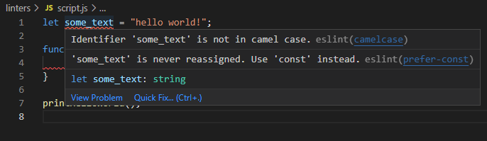

## Using ESLint with VSCode

After a few weeks into ICS 314, I was introduced to ESLint, a tool that analyzes code to find errors and formatting inconsistencies. As an extension for VSCode, ESLint scans my code as I am typing it. My first impression was that it was annoying seeing more red squiggly lines in my TypeScript code than before. Before I realized what ESLint was for, I was confused about why some things were being flagged even though they would not affect the code at all. Some examples were not having a newline after the last line of code, using double quotes instead of single quotes, or having four spaces of indentation rather than two. 

## Painful or Useful?

I find ESLint to be both painful and useful. Fixing major errors in code can already be time-consuming, so adding more errors like simple formatting inconsistencies is naturally frustrating. It sometimes feels unnecessary to fix some errors that ESLint flags when I know that the program can already produce the correct output. However, ESLint catches things such as unused variables and the use of `==` instead of `===`, which can be hard to spot on your own.

## Takeaways

While ESLint adds a bit more work to your coding, I believe that it helps with learning a new programming language and enforces better coding habits that help in the long run. When ESLint flags `var` and recommends `const`, for example, you learn why `const` is preferred when a variable does not need to be reassigned. As an active tool that works as you code, ESLint helps reinforce good coding practices while also teaching about the behaviors of the language. Even though some of the formatting errors mentioned earlier have no effect on the output of a program, consistent formatting improves code readability and organization. This becomes especially important in a team environment, as it makes it easier for everyone to read and add to a program without worrying about personal coding preferences. 

#### Use of AI
I used ChatGPT to check for spelling and grammar errors.
