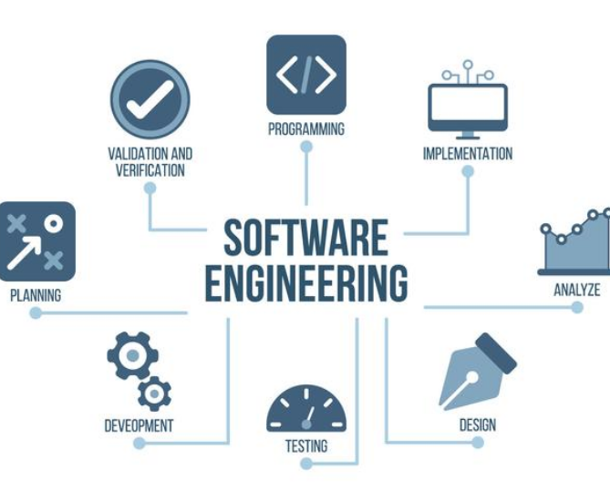

## The Role of Software Engineers

According to IBM, software development "refers to a set of computer science activities that are dedicated to the process of creating, designing, deploying and supporting software." Likewise, software engineers are the ones who "design, develop, test, and maintain software applications." As global industries become more reliant on software, it is up to software engineers to ensure that things run smoothly and reliably. Despite the rise of artificial intelligence, software engineers are still responsible for understanding design requirements and ensuring that all code, even if AI generated, is reviewed and tested. 

## My Interest in Software Engineering

As a student studying computer engineering, my main interest is towards hardware rather than software. However, since computer hardware and software go hand-in-hand, it is in my best interest to learn and practice the principles of software engineering. Having a grasp on software engineering will help me better understand how computer hardware and software interact to make a system operate the way it is intended. This is useful for complex systems often found in the aerospace field, which is one of my main interests. Additionally, software engineering involves broader skills such as team collaboration, communicating with other engineers and clients, working under time constraints, and being organized. I believe that all of these are critical for engineers in any field to become successful, and are additions to my motivation to learn software engineering.

## Future Takeaways from Software Engineering

I hope to take away several things from my software engineering class, ICS 314, such as learning new programming languages like TypeScript and understanding software engineering principles such as life cycle, deployment, testing, quality assurance, and version control. Most importantly, I intend to improve my problem-solving and troubleshooting skills through developing, debugging, and testing code. These skills will not only be useful for succeeding in ICS 314 but also in my future endeavor of being an engineer where I will be tasked with facing emerging problems and finding adequate solutions.

## Use of AI
I used ChatGPT to check for spelling and grammar errors.