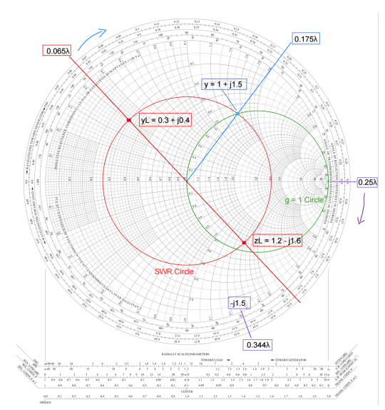

The Design of Lumped and Distributed Matching Networks for a Lossless Transmission Line was the final project for my ECE 371 Engineering Electromagnetics class. The goal was to design and compare two circuits that allowed a 2 GHz electrical signal to travel between a 50 ohm transmission line and a connected electrical load with minimal signal reflection.

To complete this project I designed two matching networks using a Smith chart and circuit calculations. The first design is a lumped element L-section matching network involving a capacitor and inductor, while the second design is a distributed element matching network involving a transmission line and short-circuit shunt stub. I built the circuit schematics in Cadence AWR Microwave Office then simulated and analyzed how much of the signal was reflected across frequency ranges of 1–3 GHz and 0–20 GHz. Finally, I compared network performance and practical implementation considerations for both networks, including frequency dependence, component parasitics, physical size, and complexity.

By completeing this project, I learned how to construct and simulate circuits in Cadence AWR Microwave Office software. I also applied concepts that I learned in class such as Smith Charts, transmission line behavior, and impedance matching.

  

 