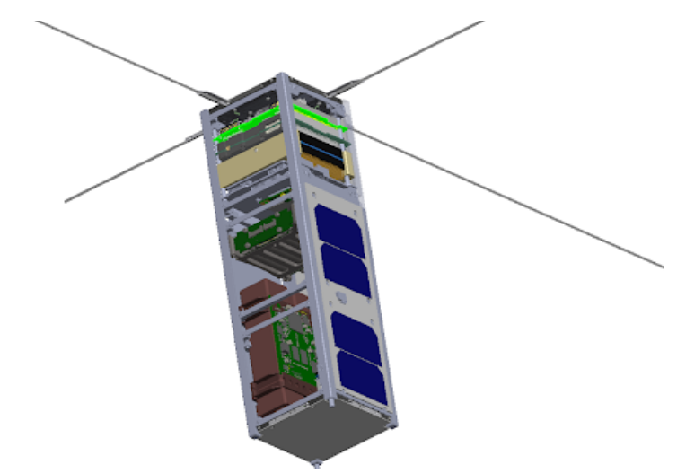

The Neutron-2 mission is an endeavor by the Hawai'i Space Flight Laboratory (HSFL) consisting of undergraduate and graduate engineering students. It is funded by the University Nanosatellite Program (UNP), an Air Force Research Laboratory program focused on small satellite systems engineering. The goal of Neutron-2 is to help improve our understanding of neutron and gamma-ray flux in low Earth orbit using compact neutron detectors developed by Arizona State University packed into two identical CubeSats developed by HSFL.

As a member of HSFL working on the Neutron-2 project, my responsibilities are within the Mission Operations and Attitude Determination and Control Subsystems. My tasks so far have involved:

- Verified the mission operations plan, including operating modes, mission phases, and CONOPS, ensuring alignment with the mission design document.

- Developed Attitude Determination and Control Subsystem requirement verification procedures, defining how each requirement will be tested and analyzed to verify system performance.

- Analyzed the CubeSat’s battery capacity throughout the mission and identified data collection periods when the available capacity was below 75%.

Concepts I have learned while working on Neutron-2 are satelite operations, mission operations planning, and systems engineering. More information on the Neutron-2 project and HSFL can be found [here](https://www.hsfl.hawaii.edu/neutron-2/).

  

