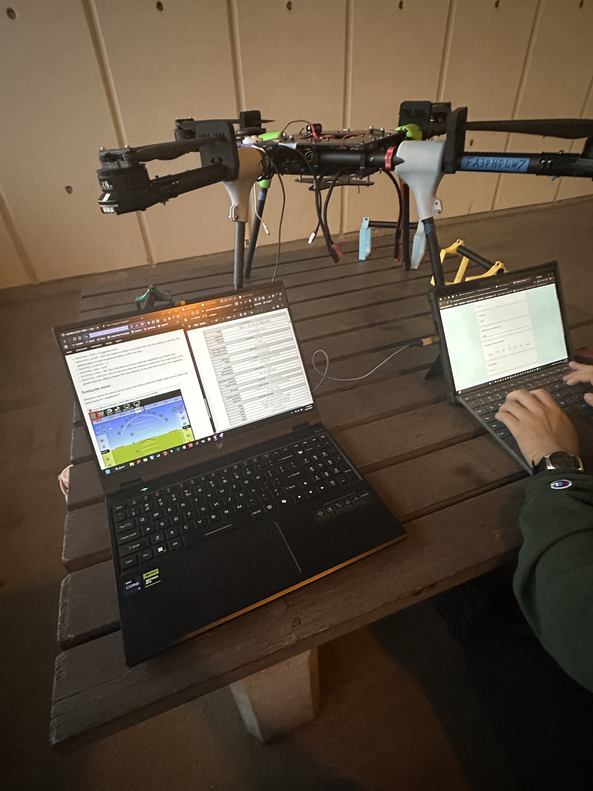

The goal of the University of Hawai'i Drone Technologies (UHDT) team is to develop an autonomous Unmanned Aerial System (UAS) that can detect unexploded ordnances (UXOs) in former U.S. Army defense sites within Hawaii. The system will aid in minimizing the risk to humans during the UXO removal process and enhance the efficiency of UXO detection. As a multidisciplinary effort, the team consists of undergraduate mechanical, electrical, and computer engineering students divided into Hardware, Software, and Image Processing Subsystems.

As a member of the Avionics Division within the Hardware Subsystem, my responsibilities included:

- Conducted trade studies on UAS avionics components across performance, cost, weight, integration, and FAA compliance to select the final system architecture.

- Tested a LiDAR altitude sensor with the UAS flight controller over I2C, monitoring telemetry through the Mission Planner ground control station to verify sensor functionality.

- Developed standard operating procedures (SOPs) for configuring the LiDAR altitude sensor’s parameters during system integration.

During my tenure at UHDT I learned about drone avionics, trade studies, and UAS functionality while gaining technical presentation and writing skills in engineering. More information about the UHDT can be found [here](https://me.hawaii.edu/design/uhdt/).

  

